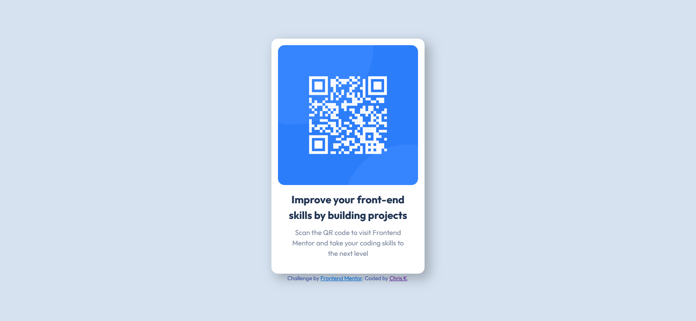

# Frontend Mentor - QR code component solution

This is a solution to the [QR code component challenge on Frontend Mentor](https://www.frontendmentor.io/challenges/qr-code-component-iux_sIO_H). Frontend Mentor challenges help you improve your coding skills by building realistic projects. 

## Table of contents

- [Overview](#overview)
  - [Screenshot](#screenshot)
  - [Links](#links)
- [My process](#my-process)
  - [Built with](#built-with)
  - [What I learned](#what-i-learned)
  - [Continued development](#continued-development)
- [Author](#author)

## Overview

### Screenshot

### Links

- Solution URL: [Add solution URL here](https://your-solution-url.com)
- Live Site URL: [Add live site URL here](https://your-live-site-url.com)

## My process

### Built with

- Semantic HTML5 markup
- CSS custom properties
- Flexbox

### What I learned

This challenge was a great way for me to put my skills to the test after watching several HTML and CSS tutorials on YouTube. One thing I learned most with this challenge was how to find and solve issues in my code. I'm really looking forward to completing more challenges.

### Continued development

I plan on continuing to learn the how and why of CSS...

## Author

- Frontend Mentor - [@chrisk71](https://www.frontendmentor.io/profile/chrisk71)

